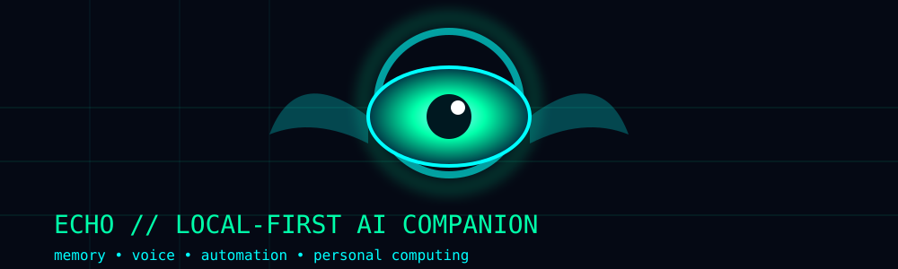

<div align="center">



# Jesus999l / Echo Lab

**Local-first AI • systems engineering • automation • perception • privacy**

Building **Echo**, a local-first AI companion focused on memory, voice, desktop perception, automation, and long-lived personal computing.

</div>

---

## `echo@local:~$ status`

```text
[ OK ] Echo research / orchestration
[ OK ] Desktop perception experiments
[ OK ] Wayland / DriftWM exploration
[ OK ] Offline voice stack experiments
[ OK ] Manhua research + preprocessing prototype
[ OK ] Cloud-connected storage research
[WIP ] Full perception → reasoning → automation loop
```

> The goal is not another chatbot. The goal is a private computing system that can observe, reason, remember, and eventually act — while keeping the important pieces local and auditable.

## Featured work

| Project | What it is | Status |
|---|---|---|
| **[Echo Vision](https://github.com/jesus999l/echo-vision)** | Perception and computer-vision experiments for Echo | Active |
| **[LatentBox](https://github.com/jesus999l/latentbox)** | AI / creativity resource collection | Public |
| **Echo** | Local-first assistant architecture, memory, voice, automation | Active / WIP |
| **DriftWM** | Experimental Wayland compositor work | Experimental |

## Current research tracks

- **Perception:** structured desktop state, accessibility metadata, screenshots and visual fallback paths.
- **Voice:** offline speech recognition and local text-to-speech experiments.
- **Automation:** controlled task execution with explicit safety boundaries.
- **Knowledge:** research pipelines, distillation, deduplication, and evidence-oriented notes.
- **Media:** manga/manhwa acquisition research, OCR, panel processing, chapter assembly, and recap preprocessing.
- **Infrastructure:** Docker, local services, object storage, and privacy-conscious cloud persistence.

## Architecture notes

- [Project map](./docs/projects.md)
- [DriftWM notes](./docs/driftwm.md)
- [Philosophy](./docs/philosophy.md)
- [Security](./docs/security/)
- [System documentation](./docs/system/)
- [Design notes](./docs/design/)

## `echo@local:~$ principles`

```text
local-first        → cloud is an extension, not the brain
privacy             → minimize secrets and unnecessary telemetry
auditable           → prefer inspectable pipelines over magic
incremental         → prove primitives before connecting subsystems
useful              → build things that survive contact with reality
```

## Public repositories

- [echo-vision](https://github.com/jesus999l/echo-vision)
- [latentbox](https://github.com/jesus999l/latentbox)
- [profile / Echo Lab](https://github.com/jesus999l/jesus999l)

---

<div align="center">

```text
┌──────────────────────────────────────────────────────────────┐
│  echo@local                                                  │
│  ├── perceive                                                │
│  ├── remember                                                │
│  ├── reason                                                  │
│  ├── act                                                     │
│  └── verify                                                  │
│                                                              │
│  BUILDING A COMPUTER, NOT JUST A CONVERSATION.               │
└──────────────────────────────────────────────────────────────┘
```

</div>
